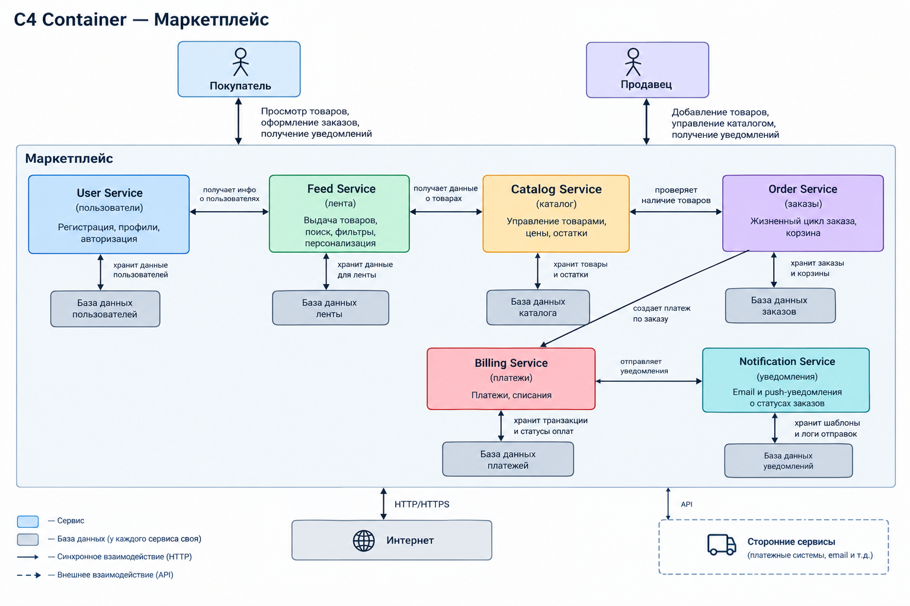

2

В репозитории реализована заглушка для User Service с health-check endpoint.

В корне проекта выполнить: docker-compose up --build -d

Проверить работоспособность: curl http://localhost:8000/health

Ожидаемый ответ: {"status": "OK"}. Сервис отдает статус 200 OK.

3+6
Вариант 1:
Домены следующие:
Каталог+лента
Заказы+платежи
уведомления
юзеры
Вариант 2:
Юзеры
Каталог
Лента
Заказы
Платежка
Уведомления
4+7
Трейд оффы:
первый варик
Меньше походов по сети, но меньше отказоустойчивость. Легче сделать мвп.
Лента должна давать большую нагрузку, может лечь каталог
второй варик
Отказойсточивость, но сложнее инфрастуктура, независимое масштабирование
8
Выбрал второй вариант
Лента должна быть супер надежной. Если ляжет платежка, то не должны ложиться заказы с корзиной.

5
1. **User Service** (Домен пользователей)
   * **Ответственность:** Регистрация, профили, авторизация.
   * **Данные:** Учетные записи, хеши паролей, роли.
2. **Catalog Service** (Домен каталога)
   * **Ответственность:** Загрузка товаров продавцами, цены, складские остатки.
   * **Данные:** Мастер-данные товаров (PostgreSQL).
3. **Feed Service** (Домен витрины)
   * **Ответственность:** Выдача товаров покупателям, поиск, фильтрация.
   * **Данные:** Денормализованные данные для быстрого чтения (Elasticsearch/Redis).
4. **Order Service** (Домен заказов)
   * **Ответственность:** Жизненный цикл заказа, корзина.
   * **Данные:** Состав корзины, статусы доставок.
5. **Billing Service** (Домен платежей)
   * **Ответственность:** платежи, списания.
   * **Данные:** Транзакции, статусы оплат.
6. **Notification Service** (Домен коммуникаций)
   * **Ответственность:** Отправка email и push-уведомлений.
   * **Данные:** Шаблоны сообщений, логи отправок.

